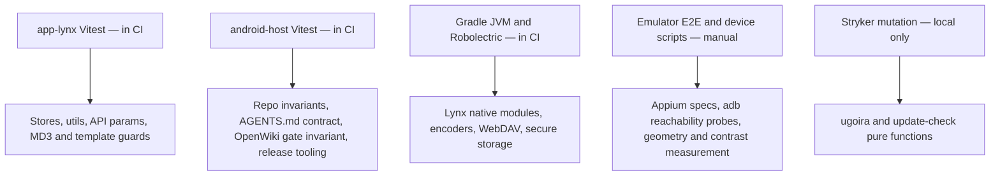

# Testing & Quality Gates

Pictelio is a **Lynx single-engine** client since the WebView client was removed in [ADR-0203](../../docs/adr/ADR-0203-webview-client-source-removal.md). The test pyramid is therefore built around one client package (`pictelio-app-lynx`), one build host (`@pictelio/android-host`), and a set of shared pure-logic packages — and it is split hard into **gates that run in CI** and **tiers that are deliberately local and manual**.

The active tiers are:

- **app-lynx Vitest** — unit, template-guard, and behavior-baseline contract suites (`pnpm test` / `pnpm test:app-lynx`).
- **android-host Vitest** — repo-invariant and contract gates plus release-tooling units (`pnpm test:android-host`).
- **JVM/Robolectric** — `@pictelio/android-host` Gradle `testDebugUnitTest` (`pnpm test:android-host:unit`).
- **Android emulator E2E** — Appium + WebdriverIO under `packages/android-host/tests/android-e2e/` (`pnpm test:android-host:e2e`, manual, never in CI).
- **Desktop-side device measurement gates** — judgement scripts plus adb I/O under `packages/app-lynx/scripts/` (geometry, contrast), also manual and non-CI.
- **Mutation testing** — local, non-CI StrykerJS over `@pictelio/ugoira` and `@pictelio/update-check` (`pnpm test:mutation`).

```mermaid
flowchart TD
    A["app-lynx Vitest — in CI"] --> A1["Stores, utils, API params, MD3 and template guards"]
    B["android-host Vitest — in CI"] --> B1["Repo invariants, AGENTS.md contract, OpenWiki gate invariant, release tooling"]
    C["Gradle JVM and Robolectric — in CI"] --> C1["Lynx native modules, encoders, WebDAV, secure storage"]
    D["Emulator E2E and device scripts — manual"] --> D1["Appium specs, adb reachability probes, geometry and contrast measurement"]
    E["Stryker mutation — local only"] --> E1["ugoira and update-check pure functions"]
```

Which tier a check belongs to, and which one must never be cached or automated.

## CI gate boundary

The authoritative boundary is `.github/workflows/ci.yml`; [AGENTS.md](../../AGENTS.md) carries the matching summary (「门禁边界」):

| CI job | Command | Scope |
|--------|---------|-------|
| `check` | `pnpm check:all` then `pnpm lint:all` | Type check (`vue-tsc` for app-lynx) + lint across the filtered packages |
| `test` | `pnpm test:all` | Vitest unit tests only — **emulator E2E never enters CI** |
| `android-unit-test` | `pnpm --dir packages/android-host run sync:credentials`, then `GRADLE_USER_HOME=$(pwd)/.gradle ./gradlew testDebugUnitTest --no-daemon` in `packages/android-host/android` | JVM/Robolectric Java units |

- **CI concurrency.** `check:all` and `test:all` default to `--concurrency-limit 2` (a value sized for memory-constrained local machines); both CI jobs export `RUN_CONCURRENCY: "9"` to use the runner's memory.
- **E2E is manual and not in CI.** This follows [ADR-0084](../../docs/adr/ADR-0084-e2e-testing-localization.md): the old agent-browser E2E job needed a real Pixiv network path plus `PIXIV_REFRESH_TOKEN`, which GitHub runners cannot reproduce, so the job was an empty shell (42/43 cases skipped) that produced false confidence. `PIXIV_REFRESH_TOKEN` is loaded only from a local `.env` (or the android-e2e `globalSetup` fallback) and **never** enters GitHub Secrets or CI logs.
- **Task-cache scoping.** `pnpm check:all` runs with `--cache`; `pnpm test:all` deliberately does **not**. A cache hit on the test gate would mean the tests never actually ran — replaying logs and producing exactly the fake green that ADR-0084 eliminated. The cache flag lives on the command line because `vp`'s `run.cache = { scripts: false, tasks: true }` makes package.json scripts uncached by default and `run.cache.scripts` is all-or-nothing, so "cache only `check`" cannot be expressed in config (see root [package.json](../../package.json)).
- **Gate freeze line.** [AGENTS.md](../../AGENTS.md) no longer carries the text: it delegates to [`workflows/review-fix-loop.md`](../../workflows/review-fix-loop.md) §门禁冻结线, which holds the five rules (30% size line against the guarded object; single-round idling diagnosis; a mutation denominator you did not choose yourself; the Goodhart warning; "fake green is worse than no gate", so every gate must register its known blind spots). Repo-wide citations of "AGENTS.md 门禁冻结线 #N" in ADRs, specs and script comments all refer to that section.

## Test tiers

### 1. app-lynx Vitest — unit, template, and contract gates

- **Config:** [packages/app-lynx/vitest.config.ts](../../packages/app-lynx/vitest.config.ts) — `environment: "node"`, includes `tests/**/*.test.ts` and `src/**/*.test.ts`, excludes `**/*.fallback.test.ts`, and injects the same compile-time constants as `lynx.config.ts` (`__APP_VERSION__` from the package `version`, `__HOME_BLEED_HEADER__: 'true'`, `__PUBLIC_CONFIG__`, `__CREDENTIALS__`). A `setupFiles` script pins the i18n locale so Node ≥22's `navigator.language` does not skew tests.
- **Fallback config:** [packages/app-lynx/vitest.fallback.config.ts](../../packages/app-lynx/vitest.fallback.config.ts) flips `__HOME_BLEED_HEADER__` to `'false'` and collects only `src/**/*.fallback.test.ts`. The macro is evaluated at `router.ts` module top level, so each polarity needs its own run and `pnpm test` runs **both** configs (`vitest run && vitest run --config vitest.fallback.config.ts`). Per ADR-0216 the `false` branch no longer renders the old 64dp top bar — it only regresses the bleed aperture (`meta 'bleed' → 'self'`, ticket #920/#906) — so the config still asserts `meta.topInset === 'self'`. It deliberately neither merges the main config (merging would drop the `.vue` source-text template-guard parsing) nor includes the template guard `recommendedBleedHeader.template.test.ts` (zero branch-coverage delta, and keeping it would stop `passWithNoTests: false` from catching a deleted real fallback test).
- **Layout:** classic logic tests under `tests/unit/` (`api/`, `composables/`, `i18n/`, `primitives/`, `stores/`, `utils/`), single-engine behavior baselines under `tests/contract/` (shared truth tables for R18/R18G restriction, URL rewrite, OAuth error classification, illust-type badges, tag mute, AI filter, WebDAV backup format/settings), and a large set of source-text/template gates at `tests/*.test.ts`. Co-located `src/**/*.test.ts` files cover components, composables, stores and utils — over a hundred files, mostly `*.template.test.ts` guards that read `.vue` source text rather than mounting components.
- **Notable gate files** (each registers its own blind spots in its header comment):
  - [md3GuardScans.test.ts](../../packages/app-lynx/tests/md3GuardScans.test.ts) — the MD3 *form-regression* scanner over `src/**`, deliberately disjoint from `md3ConfigTokens.test.ts` (which checks the official token **values** in `tailwind.config.ts` + `tokens.css`). Every rule recognises at least two written forms of the same violation and carries a "counterfactual" case plus an "extractor is itself effective" case with a hard hit-count floor, so a collapsed regex cannot turn a universal assertion vacuously green. Whitelists are `(rule, path, form)` triples with mandatory reasons; even build artifacts are exempted only per single form.
  - [motionContract.test.ts](../../packages/app-lynx/tests/motionContract.test.ts) — the single-entry motion gate (ADR-0211): it walks exported structured values, Tailwind class-name tokens and CSS duration/easing slots rather than grepping prose, and its "guarded object" is the whole motion *consumption surface* (the entry module plus all production `.ts`/`.vue`), because measuring against the single `motion.ts` file would leave no room for real assertions under the 30% size line.
  - [bottomOcclusionAllowance.test.ts](../../packages/app-lynx/tests/bottomOcclusionAllowance.test.ts) — the structural gate for ADR-0217's bottom-occlusion allowance: every scrollable page reachable from `router.ts` must carry exactly one `fab-allowance` spacer inside its scroll container unless it is listed in `NO_ALLOWANCE` with a written reason, spacers must not be conditionally rendered, and a value-flow rule requires the template height to reference a `fabGeometry`-derived identifier. Its registered limits: it is a source-text gate with no render seam (real-device spacer height is only measured by the spec), and the two `NO_ALLOWANCE` diagnostic pages depend on "content shorter than one screen" at runtime.
  - [adrClaimConsistency.test.ts](../../packages/app-lynx/tests/adrClaimConsistency.test.ts) — declaration-vs-reality gate: it recomputes ADR-0212's `md-elevation-1` consumption count from the `.vue` sources at test time and requires **every** machine-readable marker (`<!-- measured:level-1=N -->`) in the ADR to equal the recomputed value, and it re-parses the number the test file's own trailing note claims. This exists because an ADR asserting a completed migration that the code does not show is a stale claim a reader will trust.
  - [truthTableFixtureIntegrity.test.ts](../../packages/app-lynx/tests/contract/truthTableFixtureIntegrity.test.ts) — guards the six shared truth-table fixtures for coverage completeness (e.g. exactly the `3 modes × 4 ai_type` cartesian product) and zero framework dependency, replacing the pre-ADR-0203 cross-engine byte-equality assertions.
  - [captureScriptInvariants.test.ts](../../packages/app-lynx/tests/captureScriptInvariants.test.ts) — the static contract gate for `capture-md3-matrix.sh`; **frozen** under the size line, see [Desktop-side device measurement gates](#5-desktop-side-device-measurement-gates).
- **`check`** runs `vue-tsc --noEmit -p src/tsconfig.json && tsc --noEmit -p tsconfig.node.json`, so `.vue` template expressions and `defineProps`/slot inference are actually type-checked (closing the blind spot pure `tsc` silently skipped).

### 2. android-host Vitest — contract gates and repo invariants

- **Config:** [packages/android-host/vitest.config.ts](../../packages/android-host/vitest.config.ts) — `environment: "node"`, `passWithNoTests: false`, includes **two globs listed separately** (`tests/unit/**/*.test.ts` and `tests/android-e2e/unit/**/*.test.ts`) and excludes `tests/android-e2e/specs/**` (emulator specs must never leak into CI). The second glob is a deliberate gate fix from issue #818: those contract tools' pure-function tests were previously only collected by the emulator config and silently went unrun for months.
- [webviewRemovalInvariants.test.ts](../../packages/android-host/tests/unit/webviewRemovalInvariants.test.ts) — the authoritative "WebView client fully removed" gate: **10 invariant groups** (no `packages/app`; Capacitor dependency declarations zeroed; host assets present; persisted-format literals still intact; app-lynx does not cross-read the deleted dir; root command table points at the single client; facade wording converged; client-switch capability gone; Gradle entry generation present; pnpm call sites resolve), plus **19 counterfactual positive controls** (a compliant tree is built in `os.tmpdir()` and each violation is injected back to prove the same `evaluateInvariants` turns red) and **2 scan-coverage assertions** pinning the scan root/exclude list itself.
- [agentsMd.contract.test.ts](../../packages/android-host/tests/unit/agentsMd.contract.test.ts) — the AGENTS.md contract gate: a ≤30 KiB (30,720 B) volume hard gate, Fluent-spec verbatim assertions now pointing at the archive file plus an entry pointer in AGENTS.md, hard-constraint anchor survival, single-engine facade wording (`LynxActivity`, no `MainActivity`/`registerPlugin`, "Lynx 单引擎" present and "双引擎" absent), OPENWIKI marker-pair survival, stale-phrase zeroing, and root command-table reachability (every command in the AGENTS.md table must exist in root `package.json` scripts).
- [e2eContractSuiteCollected.test.ts](../../packages/android-host/tests/unit/e2eContractSuiteCollected.test.ts) — guards that the 8 `tests/android-e2e/unit/**` contract tests are both on disk and matched by the host `vitest.config.ts` include globs, so they reach `pnpm test` → `test:all` → CI. `passWithNoTests: false` can detect "nothing collected" but not "one directory dropped", and the guard is deliberately placed in `tests/unit/**` rather than in the guarded directory so that removing the glob cannot remove the guard with it.
- [openwikiGateDeadlock.test.ts](../../packages/android-host/tests/unit/openwikiGateDeadlock.test.ts) — the repo invariant for the OpenWiki **auto-merge deadlock defense**, living outside the artifact it guards exactly as the collection guard above does. Here the guarded object is not product source at all but a **CI artifact**, [`.github/workflows/openwiki-update.yml`](../../.github/workflows/openwiki-update.yml) — which an OpenWiki run can itself rewrite, because the PR's `add-paths` list includes that very file. No `yaml`/`js-yaml` is installed and one invariant does not justify a new dependency, so the test extracts the step list itself (a `/^ {6}- name: (.+)$/` line scan that slices each `- name:` line plus its body — the header comment states this explicitly) and then evaluates five invariants against the real workflow text: the post-run snapshot step `Snapshot post-run OpenWiki state` (id `poststate`) must come **before** `Create OpenWiki update pull request`; that snapshot step must read `openwiki/.last-update.json`; the step `Gate auto-merge on a complete run` must **not** read that file directly (the defect's exact shape) and must instead consume `steps.poststate.outputs`; its `status != "complete"` check must survive; and an extraction that recognises fewer than 5 steps is itself a violation.
  - **The failure mode is a permanent deadlock, not a cosmetic ordering preference.** `peter-evans/create-pull-request` restores the workspace to `main` — measured to happen with any one of `git stash push --include-untracked`, `git reset --hard origin/main`, or switching back to `main`, so no single command can be blamed — so a gate that reads the state file after that step keeps seeing the *previous* run's `status: interrupted`: the run fails, auto-merge never fires, the interrupted state is merged back into `main` by hand, and the next run locks again. The registered evidence is Actions run `37714665688` (2026-10-08), where the PR branch reported `status=complete` / `gitHead=fdf2052c` while the gate read `interrupted` / `666fe1de`.
  - **Four counterfactual positive controls** keep it from being a tautology, and they are the page's standing "a gate must prove it can go red" rule applied to a workflow file: pointing the gate back at the state file directly, moving the snapshot step after PR creation, gutting the complete check (`if false; then`), and feeding a non-workflow input to the extractor must each yield violations from the same evaluator.
  - **Registered blind spot:** what is pinned is extraction against the workflow's known 6-space `- name:` structure, **not YAML semantics**; the extractor-failure control is what stops a collapsed extractor from turning the five invariants vacuously green. The gate is collected by the `tests/unit/**/*.test.ts` glob in [packages/android-host/vitest.config.ts](../../packages/android-host/vitest.config.ts) and therefore reaches `pnpm test:android-host` → `pnpm test:all` → the CI `test` job — which is the point: a workflow edit that re-breaks the gate, or a snapshot reordering that re-arms the deadlock, turns CI red on the PR instead of silently reinstating it.
- **Release-tooling units** under `tests/unit/scripts/` cover the publish pipeline: `release-preflight`, `release-build-steps`, `release-notes-ai`, `release-branch`, `release-overwrite`, `release-uploader`, `release-version-json`, `release-panel`, `release-retired-flags`, `release-utils`, `upload-release-assets`, `changelog`, `check-push-refs`, `git-refs`, `proxy-probe`. `tests/unit/android/proguardRulesConsistency.test.ts` guards ProGuard config against source constants.

### 3. android-host JVM/Robolectric

- **Gate:** `./gradlew testDebugUnitTest --no-daemon`, run from `packages/android-host/android` after `sync:credentials` (CI's `android-unit-test` job; the local alias is `pnpm test:android-host:unit`). After the WebView client removal there are **no product flavors**, so the old per-flavor `testFullDebugUnitTest` variant gate ([ADR-0177](../../docs/adr/ADR-0177-android-gradle-test-variant-gate.md), now archived) collapsed to the single build-type task.
- **Source set:** `packages/android-host/android/app/src/test/java/io/pictelio/app/` — Robolectric/JVM units for native modules (`PictelioApiModuleTest`, `PictelioPrefsModuleTest`, `PictelioWebDavModuleTest`, `LynxSystemBarsTest`, `LynxStatusBarAppearanceTest`, `LynxDarkModeTest`), encoders/exporters (`Mp4EncoderTest`, `WebpEncoderTest`, `NovelEpubEncoderTest`, `UgoiraExporter*Test`, `BackupCryptoTest`), image pipeline (`PixivImageLoaderTest`, `ImageMemoryCacheTest`), and shared core (`SecureStorageCompatTest`, `WebDavClientTest`, `ImageHostConfigTest`).

### 4. Android emulator E2E (manual)

- **Config:** [packages/android-host/tests/android-e2e/vitest.config.ts](../../packages/android-host/tests/android-e2e/vitest.config.ts) — `root` points at the directory, includes `specs/**/*.spec.ts` + `unit/**/*.test.ts`, serial execution (`fileParallelism: false`), `testTimeout: 300_000`, `hookTimeout: 1_500_000`, `retry: 0`, and a light `globalSetup` that injects `packages/app-lynx/.env` into `process.env` (never overwriting an already-exported value).
- **Orchestration:** `setup.ts` → `setupAndroidE2e()` chains AVD detection/start, Chromedriver provisioning, APK build/install (`pnpm build:android-host`), Appium server, and a WebdriverIO session. Support modules: `appium.ts`, `avd.ts`, `chromedriver.ts`, `build-install.ts`, `driver.ts`, plus shared `pixel.ts` screenshot/color/region utilities, `transition-geometry.ts` vw-derived geometry, `prefs.ts` dev-intent login and preference seeding, and `env.ts` SDK/subprocess/timeout helpers. See [README.md](../../packages/android-host/tests/android-e2e/README.md) for AVD setup, env vars (`ANDROID_E2E_AVD`, `ANDROID_E2E_SKIP_BUILD`, `ANDROID_E2E_HTTP_PROXY`, …), and the `BENCH_NAV=1` deep-link hook.
- **Spec inventory — 12 specs** under `specs/`: `background-resume`, `delivery-probe-cold-start`, `fab-hit-testing-regression`, `lynx-bookmark-tags`, `lynx-boot-renders`, `lynx-detail-image-probe`, `lynx-network-check`, `md3-visual-tokens`, `settings-sync-contract`, `smoke`, `transition-matrix`, `webdav-backup-lynx`. Only `transition-matrix.spec.ts` carries `@release-gate`. (Prose counts drift: AGENTS.md's 测试 section still says 10 and the directory README says 11 — count the directory.)
  - `smoke` walks the full chain and asserts the current Activity is `io.pictelio.app.LynxActivity`.
  - `md3-visual-tokens` is the screenshot-sampling spec: it skips login and the Appium session entirely and deliberately does not `pm clear` (that would wipe the refresh token in SecureStorage), so it depends on an already-logged-in device and turns red on the login background otherwise. It is not release-gated.
  - `webdav-backup-lynx` is skipped by default behind `WEBDAV_E2E_ENABLED=1`; it seeds WebDAV prefs, starts the app, and asserts against the **real server's on-disk snapshot** (spec §3.2 parse plus the §8 "no password key" red line) rather than through the UI.
  - `fab-hit-testing-regression`, `transition-matrix` and `md3-visual-tokens` pin AVD `pictelio_ui` and hard-check the stable-area device geometry in `beforeAll`, because their coordinates are derived from 1080×2160 / density 480 with a 2016px stable area.
- **Cold-start delivery probe (spec `delivery-probe-cold-start`):** issue #942's manual gate for the notification delivery channel — log in via dev intent (`loginViaDevIntent`; the probe reads unread counts, so an unlogged run would report `no-unread` and send nothing), reset `notifications_last_read_time` so unread state exists, let one probe round pass the 90s quiet period and post a summary notification, `KEYCODE_HOME` + `am kill` (not `force-stop`, which clears the notification and destroys the scenario), tap the notification, then assert landing dispatch, the four-window rebroadcast, and exactly one recorded click sample. Its **oracle is native logcat** (`NotificationTapActivity` / `LynxActivity` landing lines plus the JS click-sample log), not Lynx UI selectors, with screenshots written to `tests/android-e2e/evidence/`; cold-start-ness is established by a precondition (`pidof` empty before the tap), because the broadcast-count criterion was falsified in #940. Registered blind spots: the tap uses a screen-ratio coordinate (the notification can drift with the shade's content), notification permission must already be granted, and a single run takes at least ~2.5 minutes.
- **Assertion reality:** Lynx 4.0.1's `LynxView` accessibility tree does **not** expose view/text nodes, and `uiautomator dump` is SIGKILLed on the reference AVD, so interaction is driven by adb taps/swipes and content is asserted via **screenshot + pixel analysis** (region-scoped frame diffs), not text reads.
- **Declared coverage ceiling.** The README's "机器断言覆盖面" section exists to stop a green run from being read as full coverage: touch-target size, corner radius, contrast and state-layer alpha **cannot** be structurally asserted without element bounds, and `md3-visual-tokens`' four A-class assertions (light surface, dark surface, theme switch, CTA visible bounding box) each ship a negative control while typography rhythm, elevation feel, icon optics and overall cohesion remain human-review-only. The same doctrine governs the review loop: E2E only pins chains that **only a real device can falsify**, while gate duty is carried by unit and cross-platform contract gates.
- **Removed specs:** the `client-kind-contract.spec.ts` and `switch-client-*` family were deleted with the client-switch capability (ADR-0203 decision 7); `MainActivity`/`MainActivityWebview` are gone, so there is no WebView↔native context switching and `LynxActivity` is the only entry. `transition-matrix` correspondingly dropped its R4 WebView baseline row and runs 3 rows.
- **Device-side verification tools** — `tools/` holds self-verifying shell scripts that drive a real APK on the emulator outside the Appium spec harness. They are local-only, non-CI, and documented in [tools/README.md](../../packages/android-host/tests/android-e2e/tools/README.md):
  - [verify-translation.sh](../../packages/android-host/tests/android-e2e/tools/verify-translation.sh) — navigate → PIL pixel-detect the blue translate button → tap → assert `translateStream 入口` actually fired, retrying the tap otherwise. It has two modes: the default `deepseek` mode points the seeded LLM endpoint at `https://api.deepseek.com` using `DEEPSEEK_API_KEY`, while `mock` mode uses `adb reverse tcp:8811 tcp:8811` so the app talks to the local stub at `http://127.0.0.1:8811/v1` — the one cleartext base URL the translate module allows.
  - [verify-abort.sh](../../packages/android-host/tests/android-e2e/tools/verify-abort.sh) — issue #653: it starts a **slow** mock SSE server (`MOCK_SLOW_MS=5000`), waits until the worker has entered the read loop (so `ACTIVE_CALLS.put` has happened), taps stop, then asserts `abortStream 取消:` appears while `response.completed` does not — proof that the JS abort really cancels the OkHttp Call rather than being swallowed.
  - Both build through `BENCH_NAV=1` deep links (`benchNav novel-detail --es benchNavNovelId …`), and both carry an **APK build-freshness guard**: the APK is deleted before building, `pipefail` is set, and the install is refused if packaged sources or the JS bundle are newer than the APK — because a swallowed compile failure otherwise silently replays the old build (a real incident: `gradle … | grep 'error:'` returns 0 on no match).
  - `tools/mock-responses-sse-server.mjs` is the OpenAI `/v1/responses`-compatible SSE stub (deterministic `【译N】` pseudo-translations) and `tools/mock-fail-then-recover.mjs` replays the streamed-failure → batch-fallback path anchored on spec §7.2 / ADR-0178 D2.
- **`tests/android-e2e/unit/**` is the contract-tool tier:** 8 pure-function tests (`env.flavor`, `noControlChars`, `prefs.devLogin`, `prefs.poll`, `releaseGate`, `specSkipGuard`, `transition-geometry`, `transitionMatrixWiring`) that never touch adb and run inside CI. They are also collected by the emulator config, so pushing code to its final state before a long E2E run matters — a red unit case makes that E2E round's conclusion meaningless.

### 5. Desktop-side device measurement gates

`packages/app-lynx/scripts/` holds the second manual device tier: judgement code that reads a real device (or a saved screenshot) and reports a number. The design rule is a hard split between **device I/O** and **judgement**, so that the semantics can be unit-gated in CI even though the device run cannot:

- [verify-top-inset.mjs](../../packages/app-lynx/scripts/verify-top-inset.mjs) — measures the rendered top-inset **amplitude** (not "is the status bar tinted") against independently derived platform truth: status-bar inset from `dumpsys` plus the 17.067vw top bar. It exists because a 3×-magnified compensation bug was green under a "did anything get tinted" criterion. The classification lives in the dependency-free `topInsetVerdict.mjs` and is pinned by `tests/topInsetVerdict.test.ts`; the tolerance (12 px) is derived from a registered systematic bias (title glyph band vs top-bar box centre, +3.3 px) rather than tuned until green.
- [verify-statusbar-contrast.mjs](../../packages/app-lynx/scripts/verify-statusbar-contrast.mjs) — measures the **WCAG contrast** of status-bar text over the actually composited scrim, answering "can it be read" where the amplitude script answers "is the offset right". Classification lives in `statusBarContrastVerdict.mjs` and is pinned by `tests/statusBarContrast.test.ts`. The two scripts are deliberately not merged: one needs a page *with* a top bar and the other a page *without* one, so a merge would collapse "not applicable here" and "failed" into one exit code.
- **Three-state exit codes.** These scripts return `0` PASS, `1` FAIL, and `2` REJECT — REJECT meaning the sample cannot answer the question at all (no top bar, dark backdrop, inconclusive reverse-derivation). REJECT is explicitly **not** a pass; the scripts print an explicit refusal instead of a spurious number.
- The picture-analysis probes (`find-ui-band.py` with its `find_filled_band` / `find_wide_solid` locators, `find-palette-swatches.py`, `md3-matrix-inventory.py`, `png-luma.py`) use a different four-state contract — `0` found, `1` NOTFOUND, `2` usage error, `3` input unreadable. `tests/scriptExitCodes.test.ts` pins `1` and `3` **separately** (and their distinct stderr text), because asserting only "non-zero" is exactly vacuous in the defect shape it guards: `screencap` truncation, a zero-byte file and a genuinely absent control previously all produced the same exit code, so device/cable failure was reported as "the layout changed".
- [capture-md3-matrix.sh](../../packages/app-lynx/scripts/capture-md3-matrix.sh) is the MD3 matrix orchestrator (navigation, palette/dark-mode switching, resumable sampling, exit codes). Its only CI-visible defence is the **static** contract gate [captureScriptInvariants.test.ts](../../packages/app-lynx/tests/captureScriptInvariants.test.ts), which is **frozen**: it once reached 46% of the size of the script it guards while producing one real product defect against 20+ gate defects, so per the freeze line (30%) no further detectors are added, and its unclosed blind spots are written down in the file header instead of pretending to be covered. Neighbouring gates (`findUiBand.test.ts`, `findWideSolid.test.ts`, `findPaletteSwatches.test.ts`, `md3MatrixInventory.test.ts`, `pngLuma.test.ts`) test the python probes' *criteria* with mutation-proven discriminative power tables.
- `lynx-device-check.sh`, `lynx-flow-check.sh`, `lynx-router-back-regression.sh` and `lynx-screen-analyze.py` are the older end-to-end device automation (login, feed scroll, detail, novel, R18 toggle, router back regression), and `state-layer-collapse-audit.mjs` computes which `bg-layer-*` utilities make a filled surface disappear when pressed (#867) with `--verify` to re-check its own anchors.

### 6. Mutation testing (local)

StrykerJS (with the official Vitest runner) is a **local, non-CI** sensitivity gate over the two in-process pure packages `@pictelio/ugoira` and `@pictelio/update-check`; `pnpm test:mutation` runs both and writes HTML/JSON reports to gitignored local dirs (configs at [packages/ugoira/stryker.config.ts](../../packages/ugoira/stryker.config.ts) and [packages/update-check/stryker.config.ts](../../packages/update-check/stryker.config.ts)). Mutation score is explicitly a **weak-assertion detector, never correctness evidence** — complementary to the oracle check (which catches wrong expectations). See [ADR-0101](../../docs/adr/ADR-0101-stryker-mutation-trial.md).

## QA defense lines (ADR-0163)

Four real-device defects (2026-09-15/16) all lived in state transitions and in two layers that code review plus happy-dom unit tests structurally cannot see — the **Lynx runtime-semantics layer** (`URL` polyfill `.hostname === undefined` broke search pagination) and the **cross-component contract layer** (init-only props froze the bookmark count across carousel slides). [ADR-0163](../../docs/adr/ADR-0163-qa-defense-lines.md) erects three defense lines reusing existing infra:

- **Transition matrix** — [`transition-matrix.spec.ts`](../../packages/android-host/tests/android-e2e/specs/transition-matrix.spec.ts), an `@release-gate` android-e2e spec parameterizing `list surface × user action × engine × content assertion`. After single-engine consolidation it runs **3 rows** (R1 detail-return related-works + scroll preservation; R2 search pagination + scope switch; R3 carousel card-swipe bookmark-count change). Assertions must be **content comparison** (region-scoped frame diffs), not single-frame existence — revising the old #374 existence-check doctrine. The outer disposition is a three-state classifier in [`releaseGate.ts`](../../packages/android-host/tests/android-e2e/support/releaseGate.ts): rows with `judged > 0` judge normally, `judged = 0` with `skipped > 0` warns "unverified this round" without failing, `judged = 0` with `skipped = 0` fails, and partial coverage (`judged < expected`) warns but does not fail — so content-shape-driven skips never become random red release gates while a rewritten `return` cannot pass silently. It runs before release and on big-PR manual trigger, not per-PR CI (#539).
- **Host-matrix contract test** — [`BookmarkButton.host-matrix.test.ts`](../../packages/app-lynx/src/components/BookmarkButton.host-matrix.test.ts) compiles the real `BookmarkButton.vue` (vue/compiler-sfc + a custom `createRenderer` nodeOps) to lock the init-only-props lifecycle contract across host forms: a reused carousel host must remount per work (`:key`) or state freezes on the first card. `WatchlistAction.host-matrix.test.ts` follows the same pattern.
- **Platform consistency self-check page** — [`PlatformCheck.vue`](../../packages/app-lynx/src/pages/PlatformCheck.vue) (benchNav-only `/platform-check` route, no nav entry) renders a spec-derived PASS/FAIL matrix for the platform APIs the project depends on (URL parsing, `URLSearchParams` round-trip, bridge callback quote contract) on the **real Lynx runtime**, backed by the [`safeParseUrl.ts`](../../packages/app-lynx/src/utils/safeParseUrl.ts) consolidation (`extractHostname`/`extractAuthority`) guarded by a template test forbidding bare `new URL(`.
- **Third code-review audit axis** — [`.agents/skills/code-review/SKILL.md`](../../.agents/skills/code-review/SKILL.md) adds platform/host contract checks (native `<list>` structure changes require epoch defense/spike; new Lynx global-API usage requires device probe + source guard; init-only components into a new host require a host-matrix test).

Net effect: happy-dom unit tests are **demoted from the oracle for Lynx runtime behavior** to a "browser-semantics reference", and the release checklist gains a "transition matrix must pass" step (GitHub Releases pre-release ≥3 days before stable; see [Release & Deploy](../operations/release-and-deploy.md)).

## Hard constraints

The testing conventions in [docs/testing/conventions.md](../../docs/testing/conventions.md) (verbatim-promoted from the deleted `packages/app/tests/TESTING.md`) are the detailed source of truth; [AGENTS.md](../../AGENTS.md) carries the summary. Violations count as architecture violations.

The **six hard constraints** (AGENTS.md summary numbers):

1. **IO dual-path coverage** — every function reading an external source (fetch/HTTP, Preferences, native bridge, JSON parsing) must have both success-path and failure/degradation-path unit tests.
2. **Real-sample contracts** — mocks for cross-file/cross-platform data contracts must come from real sources (live files, plugin source constants, real response snapshots), never hand-written "self-consistent" fields (the `backupRulesConsistency` pattern is the reference).
3. **No silent degradation** — every fallback path (`?? ""`, `?? null`, catch → default) must emit `console.warn` (with a module prefix) or expose an error state.
4. **Refactor invariance** — refactors touching field names, constants, config values, or defaults must check for a corresponding contract test (add one if missing) and note behavior-change points in the commit message.
5. **E2E reachability** — user-reachable interaction paths should have E2E coverage; external-state paths are covered by state construction. ⚠️ The constraint's summary text still names the WebView-era mechanism (`driver.mockFetch()` + `driver.spyOnWindowOpen()`), which no longer exists; today's state construction is benchNav deep links (`BENCH_NAV=1`) plus `loginViaDevIntent`, and the conventions doc marks the old driver sections **WebView-only**.
6. **Oracle traceability** — every test expectation must trace to an independent source (spec / acceptance sample / real data snapshot / property invariant); implementation-reverse-derived expectations, self-consistent mocks, and tautologies are suspect. Execution is the code-review skill's Oracle check + Test strength audit (ADR-0097, grounded in `docs/research/ai-generated-test-quality.md`).

> **Numbering offset.** The detailed doc numbers the oracle constraint as **#5** (= AGENTS #6) and adds a **detail-only #6, async-test determinism**, not yet mirrored in the AGENTS summary: unit tests must wait on the condition (`vi.waitFor(() => expect(...))`), never on a fixed wall-clock sleep; failure paths must finish in-flight async via `try/finally`; concurrent-mock count assertions must be keyed by business identifier (e.g. `chapterId`), never call ordinal. The defense precedent is `novelTranslateStore.test.ts`'s `describe.each` timing table, whose "hostile" slow-I/O row runs permanently so the anti-pattern is a deterministic red rather than an occasional CI flake; the diagnosis case is `docs/research/flaky-novel-translate-store-diagnosis.md`.
>
> 📌 Two drift notes on the conventions doc: its layering table still points behavior baselines at `packages/app-lynx/tests/differential/**`, but the post-ADR-0203 baselines live in `packages/app-lynx/tests/contract/**`; and the rest of its WebView-only sections (aiAssert E2E pattern, `driver.*` state injection, the Vite 5173 dev-server path) are history, not an executable path.

## Evidence discipline

The gates above are only trusted because of three repo-wide rules, stated in detail in [docs/testing/conventions.md](../../docs/testing/conventions.md) and [`workflows/review-fix-loop.md`](../../workflows/review-fix-loop.md):

- **A gate must prove it can go red (counterfactual).** Every non-trivial gate ships a positive control. The convention is enforced structurally in the strongest gates: `webviewRemovalInvariants.test.ts` builds a compliant tree and re-injects 19 violations against the same evaluator; `md3GuardScans.test.ts` feeds two re-spellings of each violation plus a hit-count floor for its extractor; `openwikiGateDeadlock.test.ts` carries the same rule outside the source tree, injecting each way the OpenWiki auto-merge gate could be re-broken into the workflow text it reads.
- **Known blind spots and false negatives must be registered, not just wins.** Files like `captureScriptInvariants.test.ts` and `bottomOcclusionAllowance.test.ts` carry explicit "what this cannot catch" lists, because "fake green is worse than no gate" — a gate that lies gets trusted. Conversely, "searched and found 0", "I ran it once" and "the gate is green" are all treated as idling evidence, never proof.
- **Expectations must trace to an independent oracle.** The gate-freeze discipline also fixes the mutation-testing denominator: "N/N bypasses caught" counts only when the N was chosen by someone other than the gate's author, and only an **external re-check** that turns a gate red counts as sealing it. Priority always runs real device / real data / user-visible behavior > gate signal.

Operationally this shows up as: `passWithNoTests: false` (T0, rejects empty or leaked test files), oxlint `expect-expect: error` (tests must contain assertions), the `scripts/verify-agent-skills.mjs` format gate for `.agents/skills/`, and the four-axis code-review skill (blast radius · read-point evidence · oracle check · platform/host contract). Pre-push routing lives in [`scripts/check-push-refs.mjs`](../../scripts/check-push-refs.mjs): an oxfmt gate on pushed files, `packages/app-lynx/(src|tests)` → the app-lynx unit run via `check-app-lynx-anchors.mjs`, and `.agents/` → the skill format check; the old `packages/app/(src|tests/agent-browser)` anchor domain was removed with ADR-0203.

## Removed suites (history)

- **Agent-browser E2E** (`packages/app/tests/agent-browser/`, 16 files / 12 specs, `pnpm test:agent-browser`) — removed with the WebView client, and the command no longer exists. It drove flows through an agent-browser CLI (`evaluate`, `mockFetch`, `spyOnWindowOpen`, `aiAssert`) and required a local Vite dev server on port 5173 plus `PIXIV_REFRESH_TOKEN`; no replacement exists (ADR-0203 consequence 4).
- **Playwright E2E** (11 spec files) had already migrated to agent-browser (ADR-0034), and **Vitest browser component tests** (29 files, `@vitest/browser-playwright`) were migrated or removed (ADR-0035); both `playwright` and `@vitest/browser-playwright` dependencies are gone.
- **WebView static anchor validation** (`packages/app/scripts/check-e2e-anchors.mjs`) was removed with the client; its successor for the surviving client is [`check-app-lynx-anchors.mjs`](../../packages/app-lynx/scripts/check-app-lynx-anchors.mjs).
- **Dual-engine differential suites** — the `WebView ↔ Lynx byte-identical` assertions lost their peer and became single-engine behavior baselines (see [tier 1](#1-app-lynx-vitest--unit-template-and-contract-gates)).
- **Dual-engine switch failure record** — [docs/android-e2e-engine-switch-known-failures.md](../../docs/android-e2e-engine-switch-known-failures.md) is an archive (marked 2026-09-28): all 10 recorded failures lived on the removed WebView↔Lynx client-switch line (`switch-client-*` specs, `MainActivity` entry routing, engine availability fallback), so the file is decision history only and its commands/paths must not be run.

## Running tests

| Command | What it runs |
|---------|--------------|
| `pnpm test` / `pnpm test:app-lynx` | app-lynx Vitest (main config + fallback config) |
| `pnpm test:android-host` | android-host Vitest (repo invariants + contract gates + release units) |
| `pnpm test:android-host:unit` | android-host JVM/Robolectric `testDebugUnitTest` |
| `pnpm test:android-host:e2e` | Android emulator E2E (manual, Appium + WebdriverIO) |
| `pnpm test:all` | all packages' Vitest unit tests (bounded concurrency; CI `test` job) |
| `pnpm test:ugoira` / `:update-check` / `:novel-export` / `:net-diagnostics` | individual shared-package unit tests |
| `pnpm test:mutation` | Stryker mutation over `@pictelio/ugoira` + `@pictelio/update-check` (local, non-CI) |
| `pnpm check:all` | type check (vue-tsc for app-lynx) + `tsc` across packages, with task cache |
| `pnpm lint:all` | oxlint across packages |
| `node packages/app-lynx/scripts/verify-top-inset.mjs` / `verify-statusbar-contrast.mjs` | manual device measurement (needs a running app on a device/emulator) |
| `bash packages/android-host/tests/android-e2e/tools/verify-translation.sh [mock]` / `verify-abort.sh` | manual device-side translation-chain verification |
| `pnpm test:agent-browser` | no longer exists |

## Key source files

| Purpose | Path |
|---------|------|
| Testing conventions (detailed, hard constraints) | `docs/testing/conventions.md` |
| Gate boundary, hard-constraint summary, evidence discipline pointer | `AGENTS.md` |
| Gate freeze line, external anchors, idling rules | `workflows/review-fix-loop.md` |
| CI workflow | `.github/workflows/ci.yml` |
| app-lynx Vitest config / fallback config | `packages/app-lynx/vitest.config.ts`, `packages/app-lynx/vitest.fallback.config.ts` |
| android-host Vitest config (two include globs) | `packages/android-host/vitest.config.ts` |
| android-e2e Vitest config | `packages/android-host/tests/android-e2e/vitest.config.ts` |
| Repo invariants gate | `packages/android-host/tests/unit/webviewRemovalInvariants.test.ts` |
| AGENTS.md contract gate | `packages/android-host/tests/unit/agentsMd.contract.test.ts` |
| E2E contract-suite collection gate | `packages/android-host/tests/unit/e2eContractSuiteCollected.test.ts` |
| OpenWiki auto-merge gate invariant (workflow step order and step outputs) | `packages/android-host/tests/unit/openwikiGateDeadlock.test.ts` |
| OpenWiki update workflow (guarded artifact) | `.github/workflows/openwiki-update.yml` |
| android-e2e contract-tool units | `packages/android-host/tests/android-e2e/unit/` |
| Release-gate transition matrix | `packages/android-host/tests/android-e2e/specs/transition-matrix.spec.ts` |
| Release-gate three-state classifier | `packages/android-host/tests/android-e2e/support/releaseGate.ts` |
| Cold-start delivery probe spec | `packages/android-host/tests/android-e2e/specs/delivery-probe-cold-start.spec.ts` |
| Device-side verification tools | `packages/android-host/tests/android-e2e/tools/` |
| Host-matrix contract tests | `packages/app-lynx/src/components/BookmarkButton.host-matrix.test.ts`, `…/WatchlistAction.host-matrix.test.ts` |
| Platform consistency self-check | `packages/app-lynx/src/pages/PlatformCheck.vue` |
| URL-domain-parse consolidation | `packages/app-lynx/src/utils/safeParseUrl.ts` |
| Behavior-baseline fixtures | `packages/app-lynx/tests/contract/` |
| MD3 form-regression scanner | `packages/app-lynx/tests/md3GuardScans.test.ts` |
| Motion single-entry gate | `packages/app-lynx/tests/motionContract.test.ts` |
| Bottom-occlusion structural gate | `packages/app-lynx/tests/bottomOcclusionAllowance.test.ts` |
| ADR declaration-vs-reality gate | `packages/app-lynx/tests/adrClaimConsistency.test.ts` |
| Device measurement scripts | `packages/app-lynx/scripts/verify-top-inset.mjs`, `…/verify-statusbar-contrast.mjs`, `…/capture-md3-matrix.sh` |
| Device-script judgement modules | `packages/app-lynx/scripts/topInsetVerdict.mjs`, `…/statusBarContrastVerdict.mjs` |
| Repo-localized code-review skill | `.agents/skills/code-review/SKILL.md` |
| Pre-push routing / agent-skills format gate | `scripts/check-push-refs.mjs`, `scripts/verify-agent-skills.mjs` |
| Mutation configs | `packages/ugoira/stryker.config.ts`, `packages/update-check/stryker.config.ts` |

## Related pages

- [MD3 Design System](../concepts/md3-design-system.md) — the token/typography/motion rules the MD3 gates enforce.
- [Viewport Geometry & Motion](../concepts/viewport-geometry-and-motion.md) — the geometry the top-inset and occlusion gates measure.
- [Android Native Integration](../integrations/android-native.md) — native modules behind the Robolectric and dev-intent test hooks.
- [API Layer](../architecture/api-layer.md) and [Release & Deploy](../operations/release-and-deploy.md) — where the tested contracts and the release gate land.
- [Quickstart](../quickstart.md) — command index.
