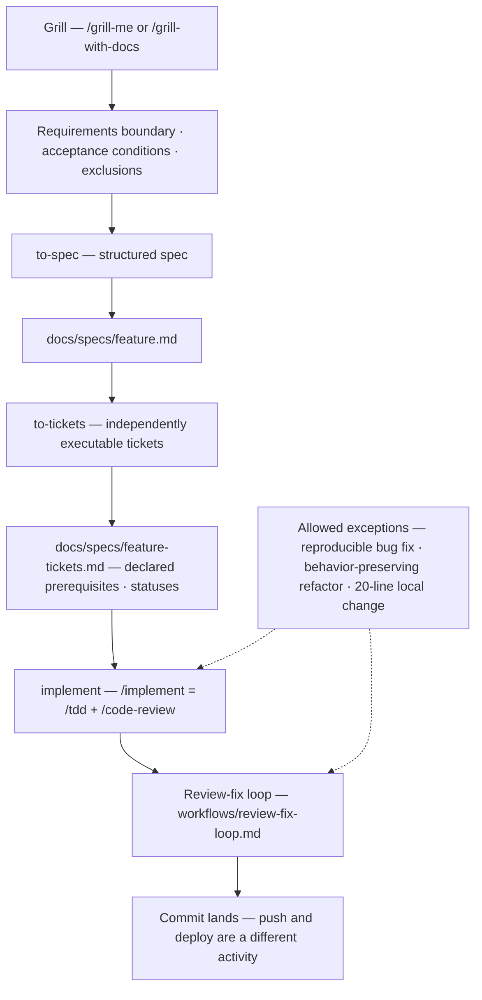
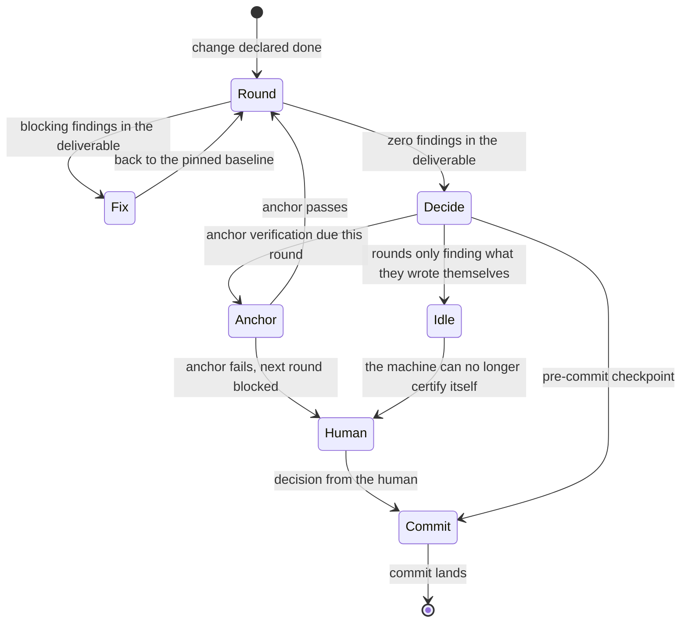
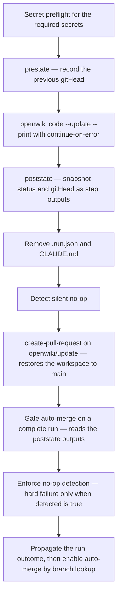

# Change & Verification Loop

This repository has one prescribed way to make a change and prove it: clarify with Grill, write a
spec, split it into tickets, implement, then run an event-triggered review–fix loop until a stop
rule fires, and finally commit behind a layered enforcement surface (git hooks, three CI jobs, and
manual device tiers that deliberately never enter CI).

This page is a **routing page**: it tells you which file owns each rule, what artifact each stage
must produce, and where the automated gates are. It deliberately does *not* restate the rules — the
repo's documentation discipline forbids keeping a second source of truth for the same fact, so when
this page and a cited file disagree, the cited file wins. Rule bodies live in
[`../../workflows/review-fix-loop.md`](../../workflows/review-fix-loop.md),
[`../../AGENTS.md`](../../AGENTS.md), [`.agents/skills/code-review/SKILL.md`](../../.agents/skills/code-review/SKILL.md)
and [`../../docs/testing/conventions.md`](../../docs/testing/conventions.md).

## Entry points: which file owns which rule

| Concern | Authoritative source | What it owns |
|---|---|---|
| The four-stage pipeline, allowed exceptions, self-supervision | [`AGENTS.md`](../../AGENTS.md) §工作流强制规范 | Stage order, the three exception paths, the duty to surface a stage conflict |
| Review–fix loop mechanics, stop rules, gate freeze line | [`workflows/review-fix-loop.md`](../../workflows/review-fix-loop.md) | Trigger, per-round procedure, checkpoints/brief, external anchors, stop rules, 门禁纪律 / 门禁冻结线 |
| Review procedure | [`.agents/skills/code-review/SKILL.md`](../../.agents/skills/code-review/SKILL.md) | Two axes (Standards + Spec) as parallel sub-agents, blocking audits (call-site completeness, read-point evidence, oracle check, platform/host contract), trigger-based dimension checkpoints |
| Loop invocation shell | [`.agents/skills/review-fix-loop/SKILL.md`](../../.agents/skills/review-fix-loop/SKILL.md) | "Read the spec first", the three most common mistakes; contains no rules |
| Test rules | [`docs/testing/conventions.md`](../../docs/testing/conventions.md) (detailed) + `AGENTS.md` 测试硬约束 (summary) | Hard constraints #1-#6 plus the detail doc's extra async-determinism rule and its numbering offset |
| Requirement intake | [`docs/agents/issue-tracker.md`](../../docs/agents/issue-tracker.md) | GitHub issues via `gh`; PRs are explicitly **not** a request surface |
| Gate boundary and test tiers | [Testing & Quality Gates](../testing/overview.md) | CI gate table, exclusion rationale, evidence discipline |
| Release and deploy | [Release, Deploy & Runbook](../operations/release-and-deploy.md) | Signing, the interactive release flow, the website deploy |

Two skills are repo-local: `.agents/skills/code-review/` (the three-audit version the loop must
use, which declares it shadows the global same-named skill) and `.agents/skills/review-fix-loop/`
(a thin shell that carries no rules and tells the reader to read the spec first). The pipeline's
other commands (`/grill-me`, `/grill-with-docs`, `/to-spec`, `/to-tickets`, `/implement`, `/tdd`,
`/diagnosing-bugs`) are not defined in this repository.

## The mandatory pipeline: stages, artifacts, exceptions

The four pipeline stages, the artifact each one must produce, and the two exception edges that bypass the pipeline but never the review–fix loop.

Stages, their required artifact, and where that artifact lives:

| Stage | Required artifact | Location |
|---|---|---|
| Grill 澄清 | Requirements boundary, acceptance conditions, exclusions | No fixed repo artifact; later stages consume it. `/grill-me` runs without the codebase, `/grill-with-docs` against it (which is also when the per-context `CONTEXT.md` files apply) |
| to-spec | Structured functional spec: data flow, state changes, boundary conditions | `docs/specs/<feature>.md` |
| to-tickets | Tickets that are individually executable, each declaring its prerequisites; a ticket whose blocker is unfinished must not be started | `docs/specs/<feature>-tickets.md`, with a dependency/deliverable/acceptance/status table |
| implement | The change, run through the review–fix loop before commit | Working tree → commit (`/implement` embeds `/tdd` + `/code-review`; clear context per ticket) |

Allowed shortcuts, each of which **bypasses the pipeline but not the review–fix loop**:

- a pure bug fix with exact reproduction steps and an expected behavior — may go straight to
  `/diagnosing-bugs`;
- a pure refactor that changes no external behavior;
- a local change of at most 20 lines that does not affect abstraction boundaries.

Crossing stages is a supervised act, not a silent one: the pipeline states that after receiving a
task you must decide which stage you are in and act only within it, and that a follow-up
instruction trying to cross a stage (for example demanding code before Grill is finished) must be
called out as a stage conflict instead of quietly obeyed. Every code change — including all three
exception paths — still runs the review–fix loop.

## The review–fix loop

The loop is an **event-triggered activity**, not a schedule: it starts when the implementer
declares the work done, its deliverable is the file set touched by that round's diff, and it ends
when the commit lands. Push and deploy are a separate activity and are not part of it.

Per-round flow, the three ways the loop stops (unpassed due anchor, idle spin, human call), and the commit checkpoint that ends it — the spec owns every threshold.

Mechanics the loop spec defines (read it for the normative wording, including every threshold):

- **Per round**: pin a fixed baseline point, run the repo-local `/code-review`, fix blocking
  findings with `/tdd`, return to the baseline; a round passes when the deliverable yields zero
  findings.
- **Convergence and stopping are separate concerns.** The spec explicitly refuses "N consecutive
  rounds with no new findings" as a success criterion, because when the agent is both the author
  of the tests and the author of the fixes the denominator is self-written. Stop triggers are
  idle spin, a due external anchor that did not pass, and a human call.
- **External anchors** (real device / real data / user-visible behavior) are triggered by the
  nature of the change — Android native changes, cross-platform contracts, real data shapes —
  with a periodic fallback count, rather than a fixed number of rounds.
- **Checkpoints and brief**: the human is pulled in at three points only (anchor verification,
  idle-spin judgment, pre-commit); the brief has five mandatory items and carries no diff.
- **Preconditions for the review itself**: the code-review skill needs a resolvable fixed point
  and a spec source (issue reference in the commit message → explicit path → matching spec file →
  ask). With no spec, the Spec axis is skipped with an explicit "no spec available" note — that
  skip is recorded, never silent.
- **The repo-local review skill is mandatory.** The loop must use `.agents/skills/code-review/`
  (Standards and Spec axes as parallel sub-agents, brief injected verbatim into the Spec axis),
  not the global generic skill. Its blocking audits are named blast-radius/call-site completeness,
  read-point evidence, oracle check and platform/host contract; the Standards axis discovers its
  sources, so the absence of `docs/development/` and `CONTRIBUTING.md` here is not a defect.
- **Out of scope for the loop**: push and deploy; the four-stage pipeline; and the writing
  discipline for gate files themselves (which lives in the loop spec's 门禁纪律 section).

Gate discipline and the freeze line are the loop spec's inner layer. It owns the criteria for a
gate's discriminative power, the bans on negative evidence ("searched and found 0", "ran it once",
"the gate is green"), the rule that every gate must register its known failure surface, and the
freeze-line rules themselves. `AGENTS.md` keeps only a redirect, and it declares that every
repo-wide citation of `AGENTS.md 门禁冻结线 #N` in ADRs, specs and script comments resolves to
that spec section; newer citations name the spec path directly (for example
[`packages/app-lynx/tests/fabOcclusionBand.test.ts`](../../packages/app-lynx/tests/fabOcclusionBand.test.ts)
cites `workflows/review-fix-loop.md §门禁冻结线 #5`).

## Enforcement surface: commit → push → CI

| Layer | Entry point | What actually runs |
|---|---|---|
| commit-msg hook | [`.husky/commit-msg`](../../.husky/commit-msg) | `pnpm exec commitlint --edit` against [`.commitlintrc.json`](../../.commitlintrc.json): Conventional Commits, header ≤ 72, lower-case scope, non-empty subject, fixed type enum |
| pre-commit hook | [`.husky/pre-commit`](../../.husky/pre-commit) | Nothing. It is a shell that documents the migration of OpenWiki generation off the commit critical path |
| pre-push hook | [`.husky/pre-push`](../../.husky/pre-push) → [`scripts/check-push-refs.mjs`](../../scripts/check-push-refs.mjs) | Precise-fetch fallback + fail-closed divergence check, then the oxfmt gate on pushed files, then directory-scoped domain checks |
| CI `check` | [`.github/workflows/ci.yml`](../../.github/workflows/ci.yml) | `pnpm check:all` then `pnpm lint:all`, `RUN_CONCURRENCY=9` |
| CI `test` | same workflow | `pnpm test:all` |
| CI `android-unit-test` | same workflow | JDK 21, `pnpm --dir packages/android-host run sync:credentials`, then `GRADLE_USER_HOME=$(pwd)/.gradle ./gradlew testDebugUnitTest --no-daemon` |
| Website deploy | [`.github/workflows/deploy.yml`](../../.github/workflows/deploy.yml) | Separate, path-filtered workflow (`packages/website/**` or manual dispatch) that builds Astro and publishes to GitHub Pages — not a change gate |
| Emulator acceptance | [`.github/workflows/sysbars-acceptance.yml`](../../.github/workflows/sysbars-acceptance.yml) | `workflow_dispatch`-only, assertion-based system-bars matrix on an API 35/36 emulator (used when the local network to `dl.google.com` is unreachable) |

CI runs on push to `main` and on pull requests to `main`, with read-only permissions and
`cancel-in-progress` per ref. The deliberate exclusions and scoping choices are:

- **Emulator E2E never enters CI.** `android-e2e` is a manual tier (`pnpm test:android-host:e2e`),
  not a PR gate; E2E pins only chains that **only a real device can falsify**, while gate duty is
  carried by unit and cross-platform contract tests. `transition-matrix.spec.ts` is the
  `@release-gate` the release flow runs before shipping. The only emulator job in Actions is the
  separate `workflow_dispatch`-only acceptance matrix, which no push or PR can trigger.
- **Mutation testing never enters CI.** `pnpm test:mutation` (StrykerJS with the Vitest runner)
  covers only the two in-process pure packages `@pictelio/ugoira` and `@pictelio/update-check`,
  and is a local weak-assertion detector — never correctness evidence.
- **Task caching is asymmetric.** `check:all` runs with `--cache`; `test:all` deliberately does
  not, because a cache hit on the test gate would mean the tests never ran (the fake green this
  repo keeps eliminating).
- **`passWithNoTests: false`** (T0, per ADR-0097) rejects empty/leaked test files; note it can
  detect "nothing collected" but not "one directory dropped", which is why the inclusion globs are
  listed separately and guarded by their own test.
- **The legacy single-engine QA checklist is retired**: the WebView transition matrix can no
  longer be executed, so
  [`docs/agents/qa-transition-checklist.md`](../../docs/agents/qa-transition-checklist.md) is
  marked non-executable, and [`docs/release-checklist.md`](../../docs/release-checklist.md) says
  that item is "considered unguarded" until #805 redefines it — plus an explicit step to verify
  the `skipped` count after an emulator run, so a disappeared release gate cannot pass silently.

Guards on the rules themselves — changing a rule means changing its guard:

- [`packages/android-host/tests/unit/agentsMd.contract.test.ts`](../../packages/android-host/tests/unit/agentsMd.contract.test.ts)
  pins the entry document: a ≤ 30,720-byte hard gate, survival of `## 工作流强制规范` and its
  anchors (`Grill 澄清 → to-spec → to-tickets → implement`, `强制闭环`, `自我监督规则`), the
  `<!-- OPENWIKI:START -->` / `<!-- OPENWIKI:END -->` marker pair, and reachability of every
  command in the `AGENTS.md` command table against root `package.json`.
- [`scripts/verify-agent-skills.mjs`](../../scripts/verify-agent-skills.mjs) (T0.5, run from
  pre-push when `.agents/` is touched) validates each `SKILL.md` frontmatter, the `name` ↔
  directory match, and — for `code-review` — a marker list including `Oracle check`,
  `Test strength`, `机器防线`, `输入源接线` and `声明—实现对照`, so the audits cannot drift out of
  the skill unnoticed.
- [`packages/android-host/tests/unit/scripts/check-push-refs.test.ts`](../../packages/android-host/tests/unit/scripts/check-push-refs.test.ts)
  drives the pre-push orchestrator through real git fixtures: fetch-failure fail-open, divergence
  fail-closed with human-readable guidance, fmt exit-code → verdict mapping (including the
  ignore-surface `skip`), multi-ref union/dedup, and a **negative** guard proving that touching the
  retired `packages/app/(src|tests/agent-browser)` path dispatches no domain at all.
- [`packages/android-host/tests/unit/openwikiGateDeadlock.test.ts`](../../packages/android-host/tests/unit/openwikiGateDeadlock.test.ts)
  pins the OpenWiki auto-merge gate's **ordering** as a repository invariant. The guarded object is
  a workflow file — one the OpenWiki run may itself rewrite, because the PR's `add-paths` includes
  it — and no YAML parser is installed, so the test extracts the step list itself (a
  `/^ {6}- name: (.+)$/` line scan that slices each `- name:` line plus its body) and then asserts
  against the real workflow text: `Snapshot post-run OpenWiki state` comes **before**
  `Create OpenWiki update pull request`, that snapshot reads `openwiki/.last-update.json`, the gate
  does **not** read that file directly and instead consumes `steps.poststate.outputs`, and the
  `status != "complete"` check survives. Each mutation has a counterfactual positive control that
  must turn the evaluator red — dropping the gate's `env:` block, moving the snapshot after the PR
  step, hollowing out the `complete` check — plus one for extractor failure (fewer than 5 recognised
  steps is itself a violation), so the test cannot decay into a permanently green fake. It is
  collected by `pnpm test:all` through the android-host `tests/unit/**` glob, so a workflow edit that
  re-breaks the gate fails CI.
- `oxlint` runs with `expect-expect: error` and a zero-warning budget from the single root
  [`vite.config.ts`](../../vite.config.ts) config, so tests must assert something.

## Decision records: ADR-first

- **System-level decisions** live in [`docs/adr/`](../../docs/adr/), numbered continuously
  (`ADR-NNNN-<slug>.md`; the oldest files carry a bare `NNNN-` prefix).
- **Context-level decisions** belong in `packages/<context>/docs/adr/`; [`CONTEXT-MAP.md`](../../CONTEXT-MAP.md)
  maps each context to its `CONTEXT.md` and states the split, and
  [`docs/agents/domain.md`](../../docs/agents/domain.md) tells agents to read the ADRs covering the
  area they are about to work in (including the context-level ones) before exploring.
- **Glossary / fact sheets** sit next to the ADRs as `docs/adr/glossary-*.md` (terminology, unit
  conversions, MD3 alignment, generated device facts and so on).
- Looking for an existing ADR **before changing behavior** is an explicit repo expectation, and a
  conflict with an existing ADR must be surfaced ("_ contradicts ADR-XXXX — but worth reopening
  because …") rather than silently overridden. The review skill treats `docs/adr/` as a
  discovery-based standards source.
- Some ADR claims are machine-checked rather than trusted:
  [`packages/app-lynx/tests/adrClaimConsistency.test.ts`](../../packages/app-lynx/tests/adrClaimConsistency.test.ts)
  recomputes a count from the `.vue` sources and requires every machine-readable marker in ADR-0212
  to equal it — an ADR asserting a completed migration the code does not show turns red.

## Generated artifacts: `openwiki/` and `CLAUDE.md`

### The CI-owned OpenWiki run

`openwiki/` is generated documentation owned by CI, not hand-editable content. Its only producer is
the scheduled workflow [`.github/workflows/openwiki-update.yml`](../../.github/workflows/openwiki-update.yml)
— a daily cron plus a manual `workflow_dispatch` with an optional `--debug`. Unlike the read-only
[`ci.yml`](../../.github/workflows/ci.yml), it declares `contents: write` and `pull-requests: write`,
because it pushes a branch and then merges it.

The **order** of its steps is the design, not incidental:

The workflow's real step order. The snapshot and both gates sit where they do because
`create-pull-request` rewrites the working tree before it commits.

1. **Secret preflight** — fail early, with configuration instructions, when
   `OPENAI_COMPATIBLE_API_KEY` (DeepSeek is reached over the OpenAI-compatible endpoint) or
   `OPENWIKI_PAT` is unset. The key check prints only length, all-whitespace and the first/last byte,
   never the value.
2. **Checkout, Node 22, generator install** — `fetch-depth: 0` because the `gitHead` diff needs the
   recorded commit to exist locally (in a shallow clone the change summary is empty and the run
   exits as a silent no-op while still reporting success), a pinned `openwiki@0.7.1` alongside
   `mermaid`/`jsdom` for diagram validation rather than `latest`, and `timeout-minutes: 150` so the
   buffered `--print` hang becomes an explicit failure instead of a dead runner.
3. **`prestate`** — read the previous `gitHead` out of `openwiki/.last-update.json` *before* the run
   overwrites it; this is the only moment at which it is still available.
4. **Run** — `openwiki code --update --print` (`--print` is required in CI: bare `openwiki` starts
   an Ink TUI and fails without a TTY), with `continue-on-error: true` so a mid-run failure still
   leaves the pages it completed, and with the provider environment pinned to the OpenAI-compatible
   endpoint (`OPENWIKI_PROVIDER`, `OPENAI_COMPATIBLE_BASE_URL`, `OPENWIKI_MODEL_ID`) plus optional
   LangSmith tracing.
5. **`poststate`** — snapshot `exists` / `status` / `gitHead` from the state file into step outputs,
   still **before** the PR step.
6. **Cleanup** — delete the transient resume state `openwiki/.run.json` and the deprecated
   `CLAUDE.md`.
7. **Path listing** — the `add-paths` allowlist: `openwiki`, `AGENTS.md`, and the workflow file
   itself.
8. **No-op detection** — compare the recorded and the new `gitHead`; only when `gitHead` advanced
   *and* non-docs source changed *and* `openwiki/` shows no content diff (excluding the pure state
   files) does it set the `detected` flag.
9. **`create-pull-request`** — branch `openwiki/update`, PAT token (a bot-authored PR would make CI
   wait for maintainer approval), `add-paths` from the listing step, `docs: update OpenWiki`.
10. **Complete-status gate** — refuse auto-merge unless the poststate snapshot says the run finished.
11. **No-op gate** — a hard failure only when the no-op flag was set; its known false-positive
    surface (a source change that legitimately touches no page) is registered in the step's own
    comment rather than left implicit.
12. **Failure propagation, then auto-merge** — re-fail the job when the run failed, then enable
    squash auto-merge by looking the PR up by branch name, because an update run does not emit a PR
    number.

**Why the gate reads a snapshot instead of the file.** `create-pull-request` restores the workspace
to `main` before committing — the workflow comment records that `git stash push --include-untracked`,
`git reset --hard origin/main`, or simply switching back to `main` is *each* sufficient, so the
cause cannot be pinned on one of those commands. A gate reading `openwiki/.last-update.json` after
that point therefore reads main's copy, i.e. the **previous** run's file. Since 0.7.x writes
`interrupted` at run start and flips to `complete` only at the end, main stayed at `interrupted`,
every run's gate failed, auto-merge never fired, a manual merge carried that `interrupted` file back
onto `main`, and the next run was locked into the same state — observed on 2026-10-06 and 2026-10-08
with `status=complete` on the PR branch and `interrupted` on main. The fix is the ordering
(`poststate` before the PR step) plus the indirection (the gate consumes `steps.poststate.outputs`,
never the file), and it is held by an invariant test rather than by the comment that documents it.

### Discipline around the generated surface

- **An interrupted or empty run still leaves its finished pages in a hand-reviewable PR, but never
  auto-merges them.** A run that fails mid-way keeps the pages it completed as a PR body that spells
  out the partial-progress contract; the two gates are what separate "keep the progress" from
  "merge it without review".
- **The wiki is optional context, not startup reading.** Agents are told not to preload or search
  the wiki at task start, to retrieve just-in-time when unfamiliar architecture or dependency
  behavior matters, and to treat source code and tests as authoritative over wiki prose.
- **Agents must not run `pnpm openwiki:update` locally** (the script is retained only for explicit
  human use) and must not hand-edit `openwiki/`; to change wiki content you change source or
  `CONTEXT.md` and let CI regenerate. A stale or failed wiki refresh does not block local work or
  commits. `CLAUDE.md` is a retired file that the OpenWiki run may recreate — never commit it.
- The `AGENTS.md` OPENWIKI marker block is part of the same CI-owned surface, which is why the
  marker pair is pinned by the `AGENTS.md` contract test.

## Related pages

- [Quickstart](../quickstart.md)
- [Testing & Quality Gates](../testing/overview.md)
- [Release, Deploy & Runbook](../operations/release-and-deploy.md)
- [MD3 Design System](../concepts/md3-design-system.md)
- [Android Native Integration](../integrations/android-native.md)
